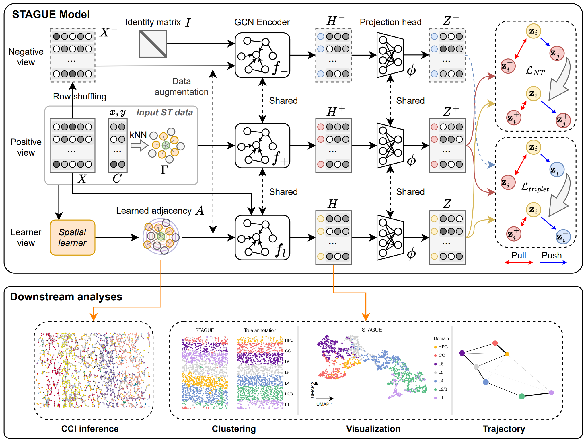

<p align="center">

</p>
<h1> <p align="center">
    Unsupervised Representation Learning for Spatial Transcriptomics with Spatially Informed Graph Structure Learning
</p> </h1>


**STAGUE** is an unsupervised representation learning model
for Spatial Transcriptomics (ST), utilizing spatially informed
graph structure learning (GSL) to integrate spatial clustering
and cell-cell interaction (CCI) inference tasks into a unified framework.
STAGUE can jointly infer biologically meaningful
**cell representations** and **cell graph adjacency matrix** for
ST data. The learned cell representations can be
used for spatial clustering, and the adjacency matrix
aids in inferring novel CCIs.

<br/>
<p align="center">
    
</p>
<br/>


# Installation & Setup
This step can be finished within a few minutes.
1. Install [Miniconda](https://docs.anaconda.com/free/miniconda/index.html) if not already available.

2. Create a new `stague` environment, activate it, and install the basic packages.
```bash
conda create -n stague python==3.10 -y
conda activate stague
pip install scanpy[leiden]==1.9.6 scikit-misc==0.3.0 louvain==0.8.1 networkx==3.2.1 rpy2==3.5.14 matplotlib jupyterlab
```

3. Install PyTorch and PyG. 
To select the appropriate versions, you may refer to the official websites of 
[PyTorch](https://pytorch.org/get-started/previous-versions/) and
[PyG](https://pytorch-geometric.readthedocs.io/en/latest/install/installation.html).
The following commands are for CUDA 11.8.
```bash
pip install torch==2.1.1 torchvision==0.16.1 torchaudio==2.1.1 --index-url https://download.pytorch.org/whl/cu118
pip install torch_geometric pyg_lib torch_scatter torch_sparse torch_cluster torch_spline_conv -f https://data.pyg.org/whl/torch-2.1.0+cu118.html
```


# Datasets
We provide an example dataset of mouse primary visual cortex (V1) under `./data/V1`.
All the fifteen datasets used in the paper can be accessed from [Google drive](https://drive.google.com/file/d/15-7aNyrVYNxKbLXh4mvTrhRpr5audw8-/view?usp=sharing).


# Run STAGUE


STAGUE takes a standard [AnnData](https://anndata.readthedocs.io/en/stable/generated/anndata.AnnData.html#anndata.AnnData) (`adata`) object as **input**.
The observations `obs` are cells/spots and variables `var` are genes.
Some annotations of observations may be stored in `adata.obs`, such as cell types `celltype` and true cluster labels `cluster`.
The **output** of STAGUE is a new `adata` object, with the following information stored within it:
- `adata.obs['cluster_pred']` The predicted cluster labels.
- `adata.obsm['embedding']` The inferred low-dimensional cell embeddings.
- `adata.obsp['learned_adj_raw']` The learned cell graph adjacency matrix before symmetric normalization.
- `adata.obsp['learned_adj_normalized']` The learned cell graph adjacency matrix after symmetric normalization.


To run STAGUE, you can execute the `main.py` file.
The required arguments are:
- `--adata_file` Path to the input AnnData file, e.g., `./data/V1/raw/adata.h5ad`.
- `--output_dir` Directory path where outputs will be saved, e.g., `./result/V1`. 
A file named `adata_processed.h5ad` will be generated under this directory.
- `--n_clusters` Number of clusters to be identified.

Other optional arguments are set with default values.
In most situations, running `main.py` with the default values can yield satisfactory performance. 
However, if desired, these values can be adjusted to obtain different clustering results.
For guidance on hyperparameter adjustment, use the `-h` option to access an overview 
and tuning suggestions for key parameters.
For example:
- `--clu_model` Unsupervised clustering algorithms applied to the learned cell embeddings. 
Choose one from `{kmeans, mclust, louvain, leiden}`.
Before using `mclust`, ensure that R is installed on your system along with the [mclust](https://cran.r-project.org/web/packages/mclust/vignettes/mclust.html) package.
The resolution for `louvain` and `leiden` is automatically searched to match `n_clusters`.
- `--adj_weight` Weight of the cosine similarity term in the learned cell graph adjacency matrix. 
Lower values (<= 0.5) are recommended for datasets with low gene coverage.
- `--k` Number of neighbors for determining the cutoff distance when inferring the learner view's cell graph adjacency matrix. 
Larger values (>= 15) are preferred.


You can run a demo with the `V1` dataset:
```bash
python main.py --adata_file ./data/V1/raw/adata.h5ad --output_dir ./result/V1 --n_clusters 7 --adj_weight 0.3 --k 25 --clu_model kmeans
```
To visualize the detailed inputs and outputs of STAGUE, refer to the [Visualization.ipynb](Visualization.ipynb) notebook.


# Spatial Clustering Benchmarking
To reproduce the reported results in the paper, we provide all the related scripts under the `./benchmark_script` directory. 
The benchmark scripts are generally configured with default hyperparameters.
Navigate to `./benchmark_script` and run the bash script.
